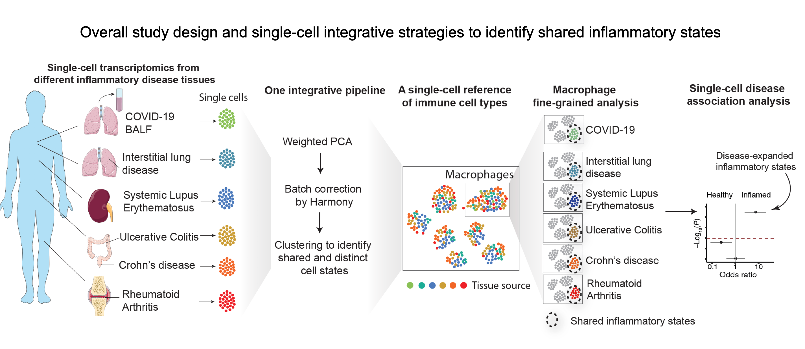

## Overview
This repo provides the source code for our analysis and figures for 

- **Citation**: Fan Zhang, Joseph R. Mears, Lorien Shakib, Jessica I. Beynor, Sara Shanaj, Ilya Korsunsky, Aparna Nathan, Accelerating Medicines Partnership Rheumatoid Arthritis and Systemic Lupus Erythematosus (AMP RA/SLE) Consortium, Laura T. Donlin*, Soumya Raychaudhuri*. IFN-γ and TNF-α drive a CXCL10+ CCL2+ macrophage phenotype expanded in severe COVID-19 lungs and inflammatory diseases with tissue inflammation. [Genome Medicine](https://genomemedicine.biomedcentral.com/articles/10.1186/s13073-021-00881-3) 13(1):64, 2021.

- **Motivation**: Understanding the immune cell states shared between COVID-19 and other inflammatory diseases with established therapies may help nominate immunomodulatory therapies.

- **Build an immune cell reference** consisting of >300,000 single-cell transcriptomic profiles from COVID-19 affected lungs and tissues from healthy subjects and patients with 5 inflammatory diseases: rheumatoid arthritis (RA), Crohn’s disease (CD), ulcerative colitis (UC), lupus, and interstitial lung disease. We tested the association of shared immune states with severe/inflamed status compared to healthy using mixed-effects modeling. 
  
  
- **Identify a CXCL10+ CCL2+ inflammatory macrophage state** that is shared and strikingly abundant in severe COVID-19 bronchoalveolar lavage samples, inflamed RA synovium, inflamed CD ileum and UC colon. We found this macrophage phenotype is induced upon co-stimulation by IFN-γ and TNF-α collaborating with the Donlin lab.
 
 
- **A proof of concept**: This reference can be used to query/investigate cells from other inflammatory diseases and their transcriptomic similarities with our reference which incorporates 5 inflammatory diseased tissues and COVID-19 BALF. We provide a [**Notebook of example code**](https://github.com/immunogenomics/inflamedtissue_covid19_reference/blob/master/code/Map_Sepsis_to_FanImmuneReference_using_Symphony_Notebook.ipynb) to show how to map Sepsis PBMCs (Reyes, et al, *Nature Medicine*, 2020) to our cross-diseased tissue single-cell reference and identify shared inflammatory structures.

## Data access
The single-cell RNA-seq data for blood-derived macrophages are available in the Gene Expression Omnibus database with accession number [GSE168710](https://www.ncbi.nlm.nih.gov/geo/query/acc.cgi?acc=GSE168710).

## Contact
Send us an email (fanzhang@broadinstitute.org and jmears@broadinstitute.org) if you have additional questions on the analyses!
